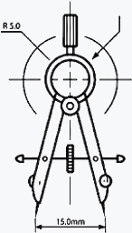

<table align=center>
 <tr><td align=center width=300>
   <b>projectMaker</b> 
   version 1.0.0
  </td></tr>
    <tr><td align=center>
    
    </td></tr>
 <tr><td align=left>
   
    <b>projectMaker</b> is a command-line tool making it easier to create projects.
     It will: 
     &nbsp;&nbsp; &bull; prompt you for a name and template 
     &nbsp;&nbsp; &bull; download and unzip the template 
     &nbsp;&nbsp; &bull; prompt you and replace all {{vars}} 
     
    projMaker defaults to fetching a web app template
   
    
    
   
   
   
  </td></tr>
</table>
